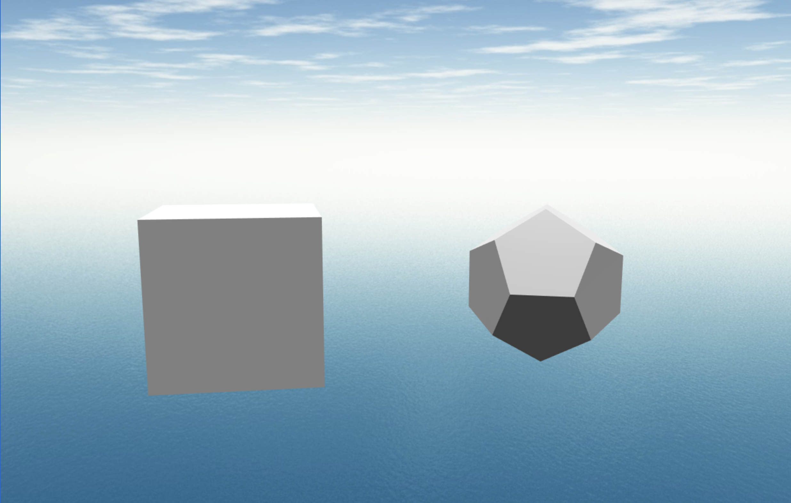
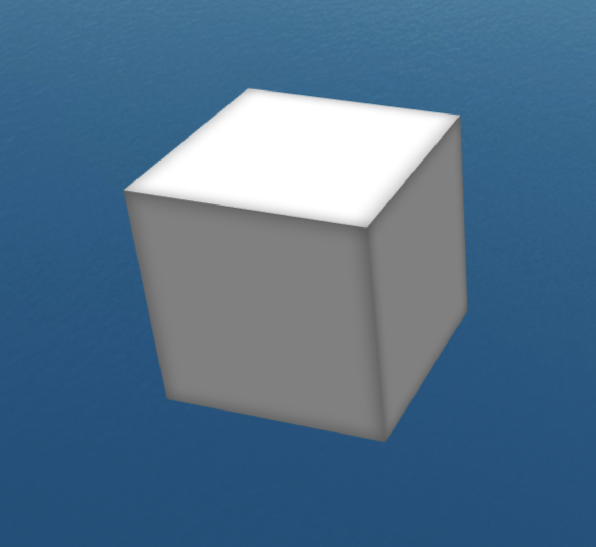

# Spot.xyz Shader Takehome

This challenge involves the implementation of a custom fragment shader to create a desired visual effect within a 3D scene.

## Getting Started

On a machine with node.js installed, navigate to this folder in your terminal and run the following commands:

```
npm install
yarn start
```

At this point a browser window should open with a 3D scene:



The goal of this challenge is to write a custom Babylon.js material which produces a shading effect similar to the following:



Note the soft shading on the corners of the box. The intended result should resemble an "inner shadow" on each face of the mesh.

To accomplish this, we ask that you create a custom Babylon.js [ShaderMaterial](https://doc.babylonjs.com/how_to/shader_material). You can find two other useful links [here](https://doc.babylonjs.com/resources/shaderintro) and [here](https://doc.babylonjs.com/how_to/putting).

There is already a placeholder in the existing code in the repository where this can be implemented within `app.ts` in the method `createMaterial`.

## Bonus Points

We leave all of the implementation details up to you, but some things that might impress us:

- Integrating the shader compilation into the webpack build pipeline.
- Having fun and creating a few more shading effects of your own design.

## Submitting the Completed Challenge

Please see the readme in the parent directory.
